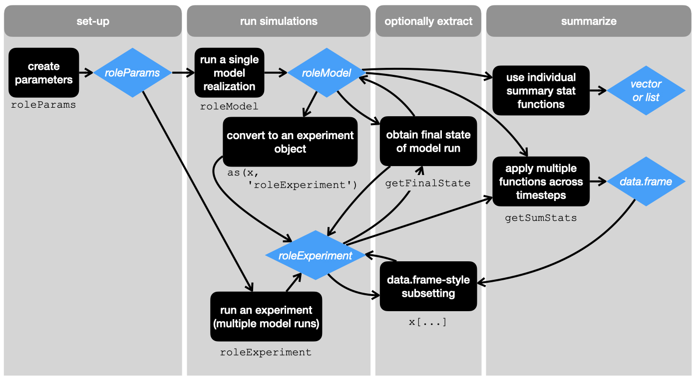

```{r setup, include = FALSE}
knitr::opts_chunk$set(
  collapse = TRUE,
  comment = "#>"
)
```


This vignette only covers simulating data using the `roleR` package implementation of the RoLE model.

## Simulation overview

The flow of simulating data is shows in the following figure.

```{r fig_flow, out.width='600px'}

```


The easiest recommended path is to work with `roleExperiment` objects, which have a familiar `data.frame`-type API.  Objects of class `roleExperiment` can be created either with the `roleExperiment` constructor function or by coercing an object of class `roleModel` to class `roleExperiment`.

Below we run through example use cases.

## Example use

These use cases are focused on running one or a small number of simulations by hand. As of now, this is intended for understanding how the API works for the purposes of integration into the RoLE model shiny app.


### Set-up and running simulations

First we make objects of class `roleParam` which contain all the necessary information to run RoLE model simulations.

```{r sim_setup}
library(roleR)

# make one set of params
params1 <- roleParams(individuals_local = 100, 
                      individuals_meta = 1000,
                      species_meta = 500, speciation_local = 0.1,
                      speciation_meta = 1, extinction_meta = 0.8,
                      trait_sigma = 1, env_sigma = 1,
                      comp_sigma = 1, dispersal_prob = 0.1, mutation_rate = 0.01,
                      equilib_escape = 1, num_basepairs = 250,
                      init_type = 'oceanic_island', niter = 100,
                      niterTimestep = 50)


# a `roleParams` object can also be made with some params missing
params0 <- roleParams(individuals_local = 100, individuals_meta = 1000,
                      species_meta = 500, speciation_local = 0.1,
                      speciation_meta = 1, extinction_meta = 0.8,
                      init_type = 'oceanic_island', niter = 100,
                      niterTimestep = 50)

# we can use standard S4 methods to make another full parameter set starting 
# using `params1` as a starting place
params2 <- params1
slot(params2, 'init_type') <- 'bridge_island'
```


Now we can use those parameters to run simulations.  We can create a single model run with the `roleModel` constructor function:

```{r oneMod}
# make one model run
oneMod <- roleModel(params1)
```

Or we can use the `roleExperiment` constructor function to simulate multiple model runs with one command.  The `roleExperiment` function takes a list of `roleParams` objects and runs one RoLE model simulation for each one of those objects in the list.

```{r oneExp}
# make an experiment with multiple models
oneExp <- roleExperiment(list(params1, params2))
```


The `experimentMeta` slot of a `roleExperiment` object contains the metadata for the experiment, which includes all the parameter values used to run the simulation.  We can see those metadata by accessing the appropriate slot

```{r oneExp_meta}
slot(oneExp, 'experimentMeta')
```


We can also coerce `roleModel` objects into objects of class `roleExperiment`

```{r coerceMod}
expFrmMod <- as(oneMod, 'roleExperiment')

# see the auto-populated metadata
slot(expFrmMod, 'experimentMeta')
```

### Extract and subset

We can easily subset a `roleExperiment` object using familiar `data.frame` syntax.

```{r subset}
# get only those model runs with fewer than 50 iterations
x <- oneExp[oneExp$iterations <= 50, ]

# view the metadata
slot(x, 'experimentMeta')
```

Note we actually used two `data.frame` type methods: `$` to extract a column and `[` to subset based on a boolean vector.

We could use this same approach to get the final state of all models:

```{r finalHard}
y <- oneExp[oneExp$iterations == max(oneExp$iterations), ]

# view the metadata
slot(y, 'experimentMeta')
```

This works in our example here, but it might not always work without more complicated boolean operations (e.g. checking the unique max iterations across different models). For that reason, and because getting the final state is likely a common use case, we wrote a specific function for getting the final state:

```{r finalExp}
finalExp <- getFinalState(oneExp)

# view the metadata
slot(finalExp, 'experimentMeta')
```

By default `getFinalState` run on a `roleExperiment` will return the final state for all models, but we can also specify specific models by their index

```{r oneFinalExp}
oneFinalExp <- getFinalState(oneExp, 1)

slot(oneFinalExp, 'experimentMeta')
```

The function `getFinalState` also has a method for `roleModel` objects.

```{r finalMod}
finalMod <- getFinalState(oneMod)
class(finalMod)
```

Here I show the class of the output to emphasize that `getFinalState` returns an object of the same class it was given, so if you give it a `roleExperiment` object you get a `roleExperiment` object back, if you give it a `roleModel` object you get a `roleModel` object back.

Objects of class `roleExperiment` and `roleModel` both contain all the raw simulated data output from the simulation at multiple timesteps.  The objects holding the data are of class `roleData`. In the case of a `roleExperiment`, the data from multiple different model runs are stored as elements in a list (one for each timestep from each model) found in the `modelRuns` slot. So to get one specific `roleData` object we ask for the `modelRuns` slot and then do simple list operations on it

```{r dataFrmExp}
# get data from one timestep saved in a `roleExperiment` object
datFrmExp <- slot(oneFinalExp, 'modelRuns')[[1]]
```


In a `roleModel` object, the `roleData` objects are stored as elements in a list (one for each timestep) found in the `modelSteps` slot. So to get one specific `roleData` object we ask for the `modelSteps` slot and then do simple list operations on it

```{r dataFrmMod}
# get data from one timestep saved in a `roleExperiment` object
datFrmMod <- slot(finalMod, 'modelSteps')[[1]]
```


### Summarize

More often than not we don't actually want to access the raw `roleData` object, we actually just want to calculate summary statistics on it.  There are built-in functions to do that, and also built-in ability to write custom user-specified summary statistic functions.

The built-in functions work on `roleData` objects, but most often users will apply them to `roleExperiment` or `roleModel` objects using the `getSumStats` function (more on that below).

First a quick tour of the functions as applied to a `roleData` object.

```{r sumStatTour}
# summary stat functions with `raw` in the name return the raw data (as a list
# containing the raw output, more on that later)

rawAbundance(datFrmMod)

rawTraits(datFrmMod)

rawGenDiv(datFrmMod)

rawSeqs(datFrmMod)

rawApePhylo(datFrmMod)

# other stat functions with derived metrics return single vectors 
hillAbund(datFrmMod, q = 1:5) # Hill numbers with exponents 1:5

richness(datFrmMod)
```


More usefully we can apply these functions over a `roleExperiment`

```{r apply_roleExp}
expSumStat <- getSumStats(oneExp, 
                          funs = list(abund = rawAbundance, 
                                      hillAbund = hillAbund, 
                                      rich = richness), 
                          moreArgs = list(hillAbund = list(q = 1:3)))


expSumStat
```

We can see this is a nice `data.frame`.  You'll notice the raw abundance column is in fact a list column.  That feature is why we force the raw functions to return lists rather than scalars or vectors.

A note on how `getSumStats` arguments work: you have to specify the functions you want to run (even if you only want to use one function) in a named list.  If the functions you want to run (like `hillAund`) require additional arguments, you must specify those in a named list `moreArgs`.

We can now use this `data.frame` to subset the experiment object itself

```{r fancySubset}
fancy <- oneExp[expSumStat$rich > 50, ]

slot(fancy, 'experimentMeta')
```


We can also write custom functions.  These custom functions should all follow a somewhat formulaic form:
- first use on of the `raw*` summary stat functions to extract a raw data type 
- then make all subsequent calculations on that output from the `raw*` function
- finally, return only a vector of length greater than or equal to 1

As an example, below I make a function to calculate the mean trait value


```{r custom}
# function to calculate trait mean 
#' @param x is a `roleData` object

meanTrt <- function(x) {
    trt <- rawTraits(x)[[1]]
    
    return(mean(trt))
}

# see the output from running this function through `getSumStats`
getSumStats(oneExp, funs = list(mTrt = meanTrt))
```
